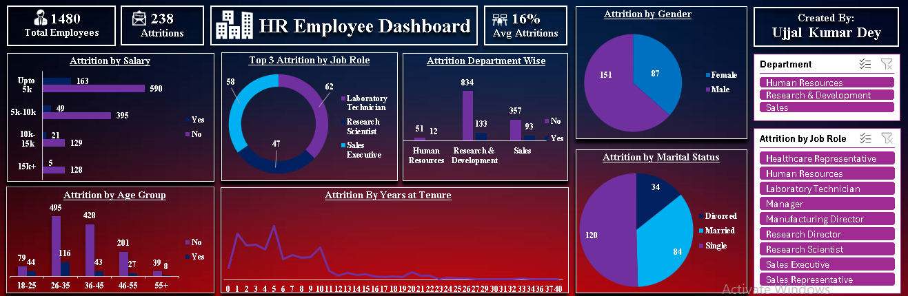
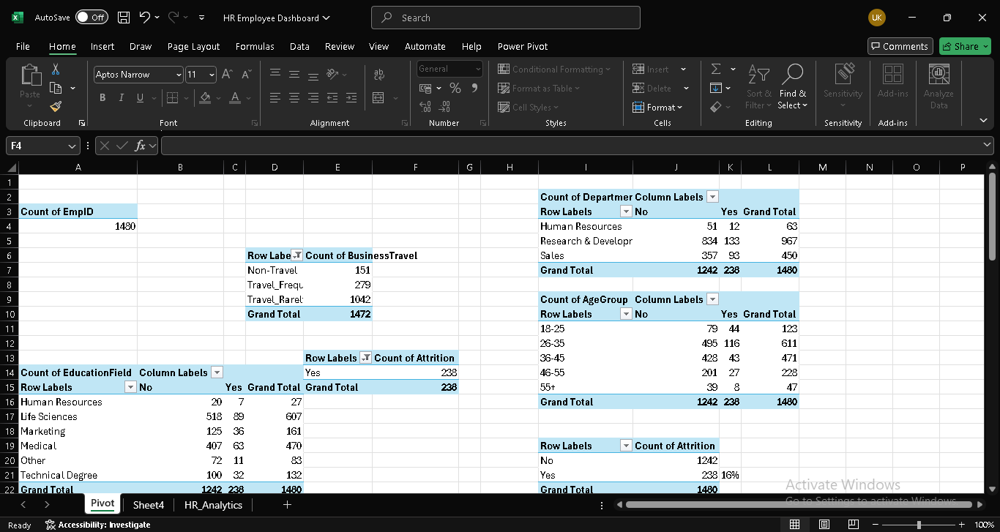
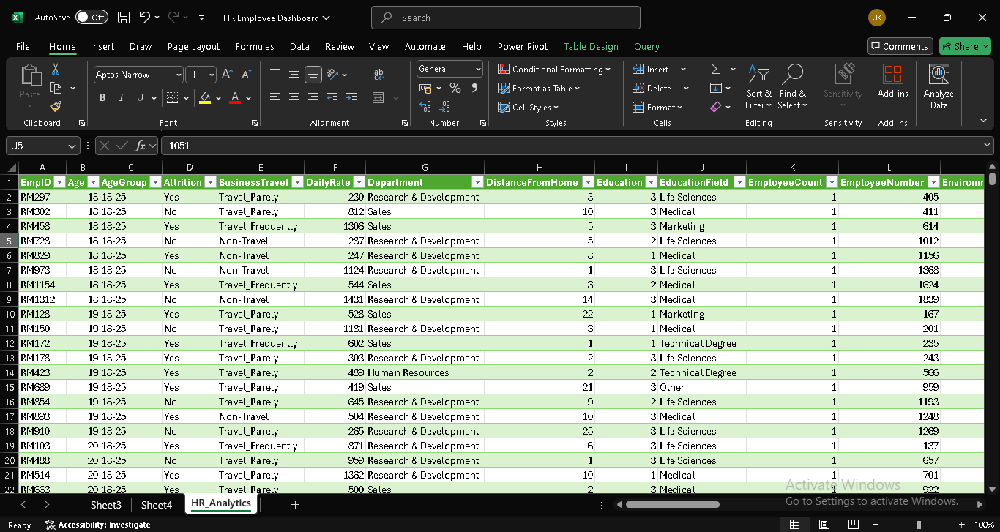
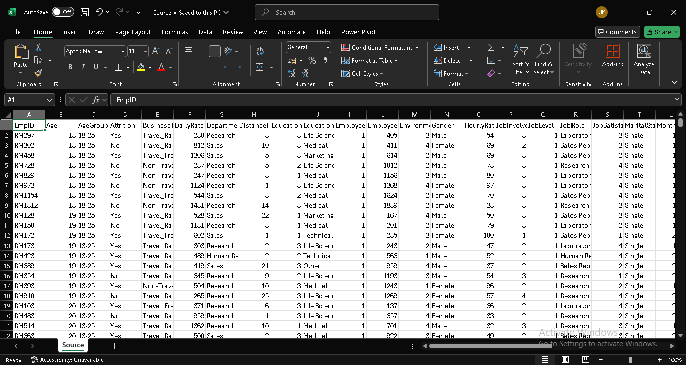

# 🧑‍💼 HR Employee Dashboard - MS Excel

This interactive dashboard provides a detailed view of HR metrics related to employee attrition. Designed for HR analysts, decision-makers, and executives, the dashboard visually summarizes employee trends across departments, salary bands, job roles, gender, marital status, and age groups.

## 📊 Key Features

- 👥 Total Employees & Attritions Count
- 📉 Average Attrition Rate
- 💰 Attrition by Salary Bands
- 🧑‍🔬 Top 3 Job Roles with Highest Attrition
- 🧪 Department-Wise Attrition Analysis
- ⚖️ Gender-Based Attrition (Pie Chart)
- 💍 Marital Status-Based Attrition
- 📅 Attrition by Years at Company (Line Chart)
- 👶 Age Group-Wise Attrition Breakdown
- 📌 Slicers for Department & Job Role Filtering

## 📁 Project Structure
```
📁 HR-Employee-Dashboard
│── img/               
│── HR_Employee_Dashboard.xlsx     # Main Excel file with pivot tables and dashboard
│── Source.csv                     # Raw data used for the analysis
│── README.md                      # Project documentation (this file)

```
## 🚀 How to Run the Project

This dashboard was built using Microsoft Excel and is intended for demonstration and learning purposes. The workbook is locked to preserve original formulas, visuals, and pivot logic. You can explore and replicate the dashboard by following the instructions below:

### 🔹 Step 1: Download the Files

Option 1:  
Click the green Code button on GitHub and select:

```bash
Download ZIP
```

Option 2: Clone the repository:
```bash
git clone https://github.com/yourusername/HR-Employee-Dashboard.git
cd HR-Employee-Dashboard

```

### 🔹 Step 2: View the Excel Dashboard

1. Open HR_Dashboard.xlsx in Microsoft Excel (2016 or later recommended).
2. Go to the Dashboard sheet to explore key KPIs, visuals, and interactive slicers.
3. Check out the Pivot and Transform Data sheets to understand how pivot tables and data preparation are structured.
4. Note: The workbook is password-protected to prevent changes. You are encouraged to replicate the logic in a new Excel workbook for learning or practice.

### 🔹 Step 3: Create Your Own Version

1. Download and open the file HR_Data.csv — this is the raw dataset used in the project.
2. Use this data to:
   - Create your own pivot tables
   - Build charts for attrition by salary, job role, department, etc.
   - Design a dashboard similar to the one shown in the project
3. Refer to the included screenshots (pivot.png, dashboard.png, etc.) for visual guidance.


## 🖼️ Screenshots

<p align="center">
  
  <br><em>Dashboard</em>
</p>

<p align="center">
  
  <br><em>Pivot Tables</em>
</p>

<p align="center">
  
  <br><em>Transformed Data</em>
</p>

<p align="center">
  
  <br><em>Raw Data</em>
</p>

## 📊 Key Insights

- 📌 Total Employees: 1,480
- 📉 Total Attritions: 238 | Avg Attrition Rate: 16%
- 💰 Most attrition in employees earning < ₹5k
- 🧪 Highest attrition in Research & Development (93 attritions)
- 🧑‍🔬 Sales Executive, Lab Technician, Research Scientist are top roles for attrition
- ⚖️ Gender: 63% Male, 37% Female among attrited
- 📈 Younger employees (26–35 years) show the most attrition
- ⏳ Early-stage employees (<5 years) are more likely to leave

 ## 🛠️ Tools Used

- Microsoft Excel – Pivot Tables, Charts, Slicers, Formatting
- CSV Dataset – HR attrition records

## 🔮 Future Scope

- Build an interactive web version in Power BI or Tableau
- Add filtering for age groups and tenure ranges
- Automate monthly data refresh via Power Query
- Add trend forecasting using linear regression or AI-based churn prediction

## 👨‍💻 Contributors

- **Ujjal Kumar Dey** 
